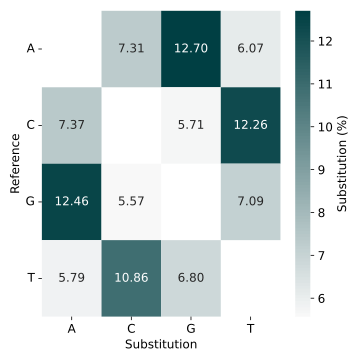

# DNA-storage-scripts notes

Some notes after encounting and solving the problems.

## add_extra_fonts_to_matplotlib.txt

To solve the problem that the default font of matplotlib does not include ***Arial***.

## align_on_MUSCLE.py

Using [MUSCLE](https://www.drive5.com/muscle/) to launch multiple-sequences-alignment.

## calc_and_plot_error.py

Output a heatmap showing **bias of base substitution errors** between references and reads, as follows.

    

## DNAReedsolomon.py

Directly perform multi-base RS encoding and decoding on DNA sequences. The default base number is **8**, and the base alphabet is `['A', 'C', 'G', 'T', 'M', 'K', 'R', 'Y']`.